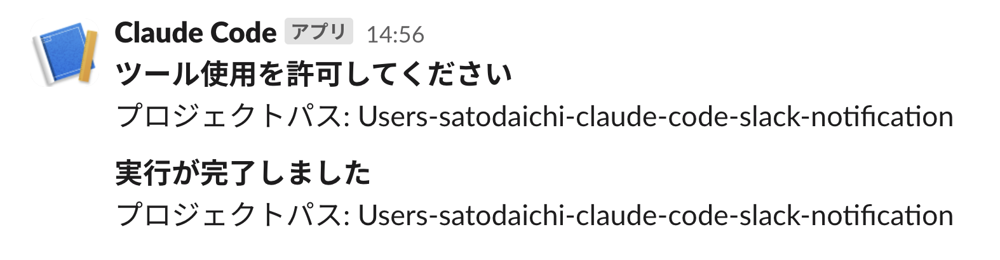

# Claude Code Slack 通知システム

Claude Code セッションのイベントを Slack に自動通知するシステムです。

## 機能

- Claude Code セッション中の特定イベントを Slack に通知
- プロジェクトパスを含む通知メッセージ
- 「Notification」と「Stop」の 2 種類のイベントに対応

## セットアップ

### 1. リポジトリのクローン

```bash
git clone https://github.com/yourusername/claude-code-slack-notification.git
cd claude-code-slack-notification
```

### 2. 環境設定

```bash
# .envファイルを作成
cp .env.sample .env

# .envファイルを編集してSLACK_WEBHOOK_URLを設定
# SLACK_WEBHOOK_URL=https://hooks.slack.com/services/YOUR/WEBHOOK/URL
```

`SLACK_WEBHOOK_URL`の取得方法はこちらの[記事](https://api.slack.com/messaging/webhooks)を参考にすること。

### 3. スクリプトの実行権限付与

```bash
chmod +x notify-slack.sh
```

### 4. Claude Code の設定

1. `~/.claude/`ディレクトリにこのプロジェクトをコピー
2. `settings.json`を Claude Code の設定ディレクトリに配置

## 使用方法

Claude Code が自動的にイベント発生時にスクリプトを実行します。手動でテストする場合：

```bash
# 通知テスト
echo '{"transcript_path": "/path/to/project/transcript.json"}' | ./notify-slack.sh Notification

# 停止通知テスト
echo '{"transcript_path": "/path/to/project/transcript.json"}' | ./notify-slack.sh Stop
```

## 通知の表示例

以下のようなメッセージが Slack に送信されます：



## ファイル構成

- `notify-slack.sh` - Slack 通知を送信するメインスクリプト
- `settings.json` - Claude Code の hooks 設定ファイル
- `.env.sample` - 環境変数のサンプルファイル

## 必要要件

- Bash
- curl
- jq
- Slack Webhook URL
